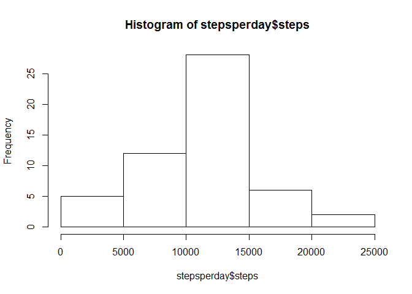
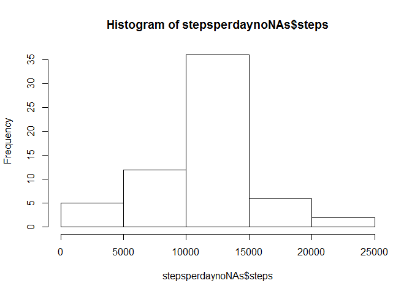

# Reproducible Research: Peer Assessment 1 by Michael Fearon


### Loading and preprocessing the data


```r
setwd("C:/Users/Mike/ReproducibleResearch/RepData_PeerAssessment1")
unzip("activity.zip")
activity <- read.csv("activity.csv")
str(activity)
```

```
## 'data.frame':	17568 obs. of  3 variables:
##  $ steps   : int  NA NA NA NA NA NA NA NA NA NA ...
##  $ date    : Factor w/ 61 levels "2012-10-01","2012-10-02",..: 1 1 1 1 1 1 1 1 1 1 ...
##  $ interval: int  0 5 10 15 20 25 30 35 40 45 ...
```

```r
head(activity)
```

```
##   steps       date interval
## 1    NA 2012-10-01        0
## 2    NA 2012-10-01        5
## 3    NA 2012-10-01       10
## 4    NA 2012-10-01       15
## 5    NA 2012-10-01       20
## 6    NA 2012-10-01       25
```

## What is mean total number of steps taken per day?
Calculate the total number of steps taken per day

```r
stepsperday<-aggregate(steps ~ date, data=activity, FUN=sum)
```

Make a histogram of the total number of steps taken each day

```r
hist(stepsperday$steps)
```

<!-- -->

Calculate and report the mean and median of the total number of steps taken per day

```r
mean(stepsperday$steps,na.rm = TRUE)
```

```
## [1] 10766.19
```

```r
median(stepsperday$steps,na.rm = TRUE)
```

```
## [1] 10765
```
## What is the average daily activity pattern?
Make a time series plot (i.e. type = "l") of the 5-minute interval (x-axis) and the average number of steps taken, averaged across all days (y-axis)


```r
stepsper5minInterval <- aggregate(steps ~ interval, data = activity, mean, na.rm = TRUE)
plot(steps ~ interval, data = stepsper5minInterval, type = "l")
```

<!-- -->

Which 5-minute interval, on average across all the days in the dataset, contains the maximum number of steps?


```r
stepsper5minInterval[which.max(stepsper5minInterval$steps), ]$interval
```

```
## [1] 835
```

## Imputing missing values

Calculate and report the total number of missing values in the dataset (i.e. the total number of rows with NAs)

```r
sum(is.na(activity$steps))
```

```
## [1] 2304
```

Devise a strategy for filling in all of the missing values in the dataset. The strategy does not need to be sophisticated. For example, you could use the mean/median for that day, or the mean for that 5-minute interval, etc.

I will replace the NA values with the mean value for that interval.

Create a new dataset that is equal to the original dataset but with the missing data filled in.


```r
activitywithoutNAs<-activity
activitywithoutNAs<-merge(activitywithoutNAs, stepsper5minInterval, by="interval", suffixes=c("",".y"))
nas <- is.na(activitywithoutNAs$steps)
activitywithoutNAs$steps[nas] <- activitywithoutNAs$steps.y[nas]
head(activitywithoutNAs)
```

```
##   interval    steps       date  steps.y
## 1        0 1.716981 2012-10-01 1.716981
## 2        0 0.000000 2012-11-23 1.716981
## 3        0 0.000000 2012-10-28 1.716981
## 4        0 0.000000 2012-11-06 1.716981
## 5        0 0.000000 2012-11-24 1.716981
## 6        0 0.000000 2012-11-15 1.716981
```

```r
sum(is.na(activitywithoutNAs$steps))
```

```
## [1] 0
```

Make a histogram of the total number of steps taken each day


```r
stepsperdaynoNAs<-aggregate(steps ~ date, data=activitywithoutNAs, FUN=sum)
hist(stepsperdaynoNAs$steps)
```

<!-- -->
Calculate and report the mean and median total number of steps taken per day. 


```r
mean(stepsperdaynoNAs$steps)
```

```
## [1] 10766.19
```

```r
median(stepsperdaynoNAs$steps)
```

```
## [1] 10766.19
```
Do these values differ from the estimates from the first part of the assignment? What is the impact of imputing missing data on the estimates of the total daily number of steps?

The mean value does not change from its previously calculated value, but the median has changed to now be equal in value to the mean.


## Are there differences in activity patterns between weekdays and weekends?

Create a new factor variable in the dataset with two levels - "weekday" and "weekend" indicating whether a given date is a weekday or weekend day.

```r
dowfunction<-function(date){
  day<-weekdays(date)
  if(day %in% c("Saturday","Sunday"))
    return("weekend")
  else
    return("weekday")}
activitywithoutNAs$date<-as.Date(activitywithoutNAs$date)
activitywithoutNAs$dayofweek<-sapply(activitywithoutNAs$date, FUN=dowfunction)
head(activitywithoutNAs)
```

```
##   interval    steps       date  steps.y dayofweek
## 1        0 1.716981 2012-10-01 1.716981   weekday
## 2        0 0.000000 2012-11-23 1.716981   weekday
## 3        0 0.000000 2012-10-28 1.716981   weekend
## 4        0 0.000000 2012-11-06 1.716981   weekday
## 5        0 0.000000 2012-11-24 1.716981   weekend
## 6        0 0.000000 2012-11-15 1.716981   weekday
```

```r
table(activitywithoutNAs$dayofweek)
```

```
## 
## weekday weekend 
##   12960    4608
```
Make a panel plot containing a time series plot (i.e. type = "l") of the 5-minute interval (x-axis) and the average number of steps taken, averaged across all weekday days or weekend days (y-axis). 


```r
library(lattice)
stepsbydayofweektype <- aggregate(steps ~ interval + dayofweek,
                            data=activitywithoutNAs, FUN=mean)
xyplot(steps ~ interval | dayofweek, data=stepsbydayofweektype, type="l", grid=T, layout=c(1,2))
```

<!-- -->
